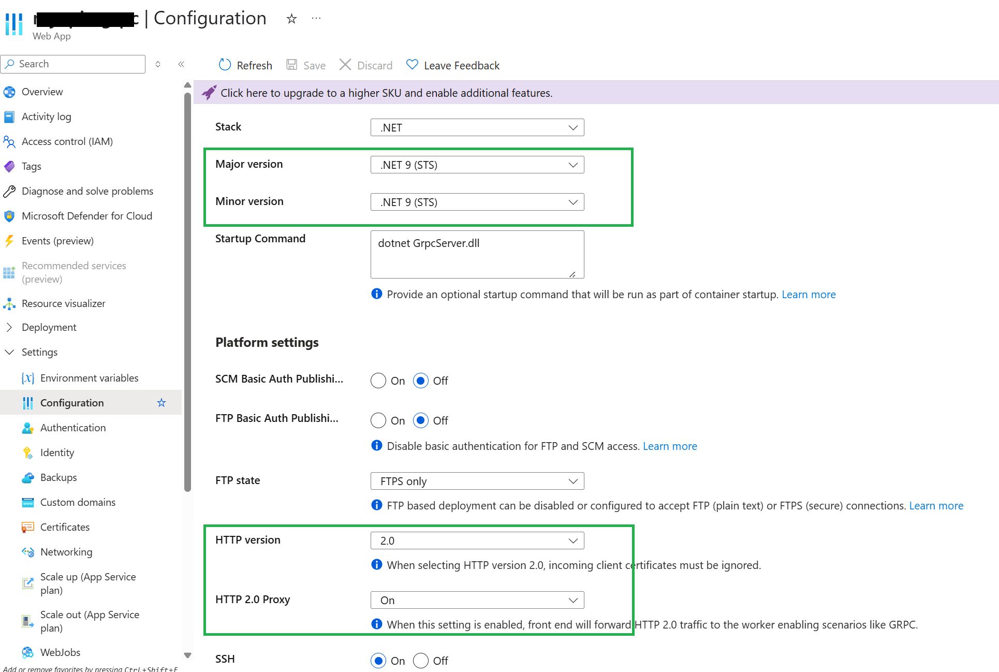
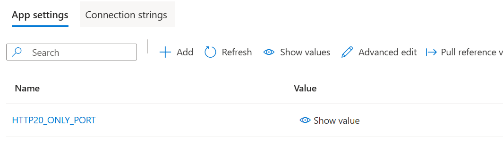
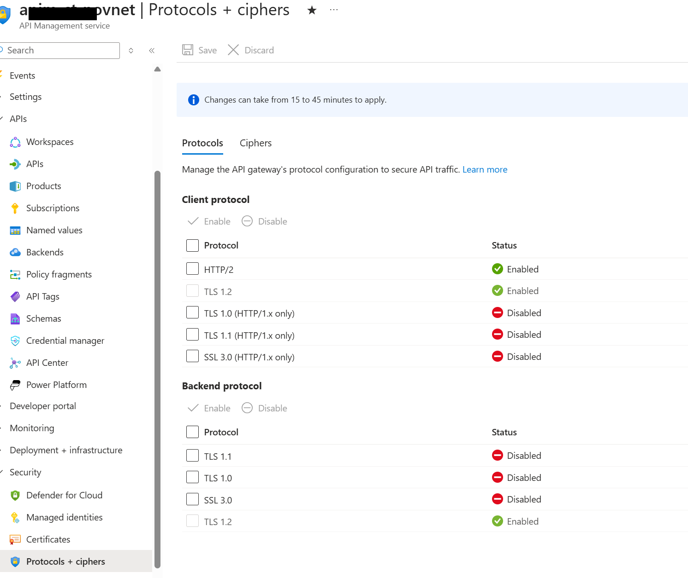

# Azure API Management - Deploy gRPC API on Azure API management using self hosted gateway

This is a complete guide with steps by step process to deploy the gRPC and how to use Azure API Management to import the gRPC API.
It cover step‑by‑step guide to deploying a gRPC API on Azure API Management (APIM), grounded in the Microsoft documentation and a real-world deployment workflow.
The API Management can expose gRPC services, but with important constraints:
 - APIM supports gRPC by importing a .proto file and forwarding calls to a gRPC backend. 
 - gRPC requires HTTP/2 end‑to‑end.
 - gRPC APIs are supported in Self-hosted gateway and not supported in APIM v2 tiers. 
 - You can't use the test console to test gRPC

The major steps claissfied in two major steps
1. Creating a gRPC server
2. Calling the gPRC application using APIM

## 1. Creating gRPC Application
Typical backend deployment steps include the following
- Create a .NET gRPC server application
- Create a .NET gRPC client application
- Test the setup locally 
- Publish the .NET gRPC server to Azure WebApp and verify the service works directly over HTTPS

## 2. Calling gRPC from APIM
Typical API deployment steps include the following
- Deploy the self hosted gateway on Azure API management.
- Import the gRPC API in API Management
- Update the .NET gRPC client application to test using API management. 
- Since gRPC requires HTTP/2 for inbound and outbound traffic make sure that you enabled HTTP/2 protocol for client traffic.
- Go to API Management(left side blade) Settings → Protocols & Ciphers
- Enable HTTP/2

Step-1 
As a first step we will be building a .NET gRPC server application. 
You can skip this step in case you already have gRPC server application.
If you would like to view .NET Core sample used for this sample project, please visit [here](https://github.com/shailugit/GrpcServer).

Step-2
As a second step we will be building a .NET gRPC client application. You can skip this step in case you already have gRPC client.
If you would like to view .NET Core client used for this sample project, please visit the below [here](https://github.com/shailugit/GrpcClient).

Step-3
Once your client and server code is ready here are the steps to Test your application locally 

Step-4
Deploy the server to Azure WebApp
Please make sure to enable HTTP version, **Enable HTTP 2.0 Proxy and add HTTP20_ONLY_PORT application setting as gRPC only work using http2.0 as shown below**

please visit [here](https://github.com/Azure/app-service-linux-docs/blob/master/HowTo/gRPC/Linux/.NET/use_gRPC_with_dotnet.md).

Step-5
Deploy the self hosted gateway on Azure API management as explianed [here](https://learn.microsoft.com/en-us/azure/api-management/api-management-howto-provision-self-hosted-gateway)

Step-6
Import the gRPC API in API Management and enable the http2 in API management as shown below
- Open your APIM instance in Azure Portal.
- Go to APIs > Under Define a new API, select gRPC.
- Upload your .proto file.
- Enter your gRPC server URL (must be HTTPS + HTTP/2).
- Select the gateway you want to expose it on.
- Click Create.
- API will Parse the .proto file and create operations for each RPC method and Map them to the backend service

[Ref this link](https://learn.microsoft.com/en-us/azure/api-management/azure-openai-api-from-specification#test-the-azure-openai-api)

Step-7
Update the .NET gRPC client application to test using API management.

## Common Issues & Fixes
APIM cannot route the request
Cause: .proto mismatch or wrong method name.
Fix: Re-import correct .proto. 

Backend not reachable
Cause: HTTP/2 disabled on App Service.
Fix: Enable HTTP/2 + HTTP2 Proxy. 

Testing fails in APIM portal
Cause: Portal does not support gRPC testing.
Fix: Use external gRPC client. 
