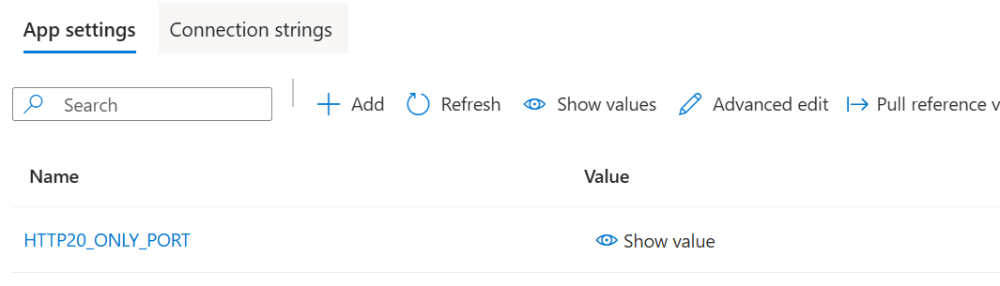

# How-to deploy a gRPC on Azure API management

This is a complete guide with steps by step process to deploy the gRPC and how to use Azure API Management to import the gRPC API.
The major steps claissfied as below.

	- Create a .NET gRPC server application
	- Create a .NET gRPC client application
	- Test the setup locally 
	- Publish the .NET gRPC server to Azure WebApp
	- Deploy the self hosted gateway on Azure API management.
	- Import the gRPC API in API Management
 	- Update the .NET gRPC client application to test using API management. 

Step-1 
As a first step we will be building a .NET gRPC server application. You can skip this step in case you already have gRPC server application.
If you would like to view .NET Core sample used for this sample project, please visit [here](https://github.com/shailugit/GrpcServer).

Step-2
As a second step we will be building a .NET gRPC client application. You can skip this step in case you already have gRPC client.
If you would like to view .NET Core client used for this sample project, please visit [here](https://github.com/shailugit/GrpcClient).

Step-3
Once your client and server code is ready here are the steps to Test your application locally 

Step-4
Deploy the server to Azure WebApp
Please make sure to enable HTTP version, Enable HTTP 2.0 Proxy and add HTTP20_ONLY_PORT application setting as gRPC only work using http2.0 as shown below

please visit [here](https://github.com/Azure/app-service-linux-docs/blob/master/HowTo/gRPC/Linux/.NET/use_gRPC_with_dotnet.md).

Step-5
Deploy the self hosted gateway on Azure API management as explianed [here](https://learn.microsoft.com/en-us/azure/api-management/api-management-howto-provision-self-hosted-gateway)

Step-6
Import the gRPC API in API Management and enable the http2 in API management as shown below

[Ref this link](https://learn.microsoft.com/en-us/azure/api-management/azure-openai-api-from-specification#test-the-azure-openai-api)

Step-7
Update the .NET gRPC client application to test using API management.
